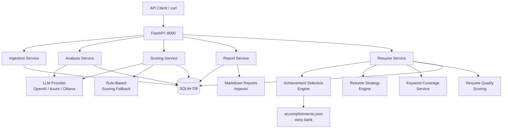

# CareerAgent

**Your AI-powered career intelligence assistant for software engineering leaders.**

CareerAgent analyzes job postings against your experience profile and scores how well each opportunity matches your background — so you spend your application effort on the roles most worth pursuing.

---

## Features

- **Job Posting Ingestion** — paste text, upload `.txt` / `.md` files, or POST via API
- **Candidate Profile** — structured JSON capturing work history, leadership, certifications, AI experience, and career goals
- **AI-Driven Job Analysis** — LLM extracts structured requirements from any job posting
- **Scoring Engine** — 0–100 scores across 6 dimensions with explanations
- **Gap Analysis** — missing skills, keywords, certifications, and leadership signals
- **Application Recommendation** — Strong Apply / Apply / Stretch / Low Priority
- **Markdown Reports** — shareable, downloadable analysis reports
- **Rule-Based Fallback** — works without an LLM API key using heuristic scoring
- **Background Analysis Queue** — submit analysis jobs to run in the background and poll for completion without blocking the request thread
- **Achievement Selection Engine** — ranks your accomplishment/story bank against a job's requirements, with explainable reasons and optional boosting for accomplishments you want to feature
- **Resume Strategy Engine** — picks a resume persona (e.g. AI Transformation Leader, Compliance & Governance Leader) and decides what to emphasize, deemphasize, or omit
- **Keyword Coverage Report** — shows how many of a job's important keywords are demonstrably covered by your profile before a resume is generated
- **Resume Quality Scoring** — scores a generated resume/strategy across keyword coverage, leadership signal strength, AI relevance, and manager-of-managers alignment
- **Traceable Resume Data Model** — every generated resume section/bullet is grounded in `candidate_profile.json` / `accomplishments.json`; nothing is invented

---

## User Guide

CareerAgent helps you answer three practical questions:

1. Is this job a good fit for my background?
2. What skills or experience match the posting best?
3. What resume markdown should I use for this application?

You do that in four simple steps: load your profile, add a job posting, run analysis, and generate a tailored resume plan.

### What You Need

Before using CareerAgent, make sure you have:

- A candidate profile JSON file, usually `data/candidate_profile.json`
- A job posting, either:
  - saved as a `.md` or `.txt` file
  - pasted in as raw text
- The app running locally at `http://localhost:8000`
- Optional: an LLM API key for improved requirement extraction

If no API key is configured, CareerAgent still works using rule-based extraction and scoring.

### Easiest Way To Use It

If you are not comfortable with command-line tools, open:

- API docs: `http://localhost:8000/docs`

The `/docs` page gives you a form-based interface where you can upload files and run each step without writing code.

### Standard Workflow

#### 1. Load your profile

Load your candidate profile once at the start of a session, or anytime your profile changes.

You can:

- Upload `data/candidate_profile.json`
- Or send the same JSON directly to the profile endpoint

This profile is the source of truth for scoring, gap analysis, and resume generation.

#### 2. Add a job posting

You can provide a job posting in either of these formats:

- Upload a Markdown or text file
- Paste the raw job description text

CareerAgent stores the posting and returns a job ID. Save that ID, because you will use it for analysis, reports, and resume generation.

#### 3. Run job analysis

Running analysis gives you:

- extracted job requirements
- a 0–100 overall match score
- a recommendation:
  - Strong Apply
  - Apply
  - Stretch Opportunity
  - Low Priority
- a gap analysis showing missing skills, keywords, certifications, or leadership signals

This is the step that tells you whether the opportunity is worth pursuing.

#### 4. Generate a resume plan and markdown

After analysis is complete, you can generate a tailored resume plan for that specific job.

The resume response includes:

- ranked accomplishments selected for the role
- a resume strategy showing what to emphasize, deemphasize, or omit
- keyword coverage reporting
- a structured resume data model
- a resume quality score
- rendered markdown you can copy into your resume file

### What CareerAgent Produces

#### Match score and recommendation

CareerAgent scores each job across these areas:

- leadership match
- technical match
- cloud match
- AI match
- management scope match
- industry match

Recommendation tiers:

- 85–100: Strong Apply
- 70–84: Apply
- 55–69: Stretch Opportunity
- 0–54: Low Priority

#### Gap analysis

Gap analysis helps you understand what may weaken your candidacy, including:

- missing keywords
- missing leadership signals
- missing certifications
- notable risks or weak-fit areas

This is useful both for deciding whether to apply and for tailoring your resume.

#### Tailored resume markdown

CareerAgent can generate resume markdown grounded in your actual source data.

It does not invent:

- employment history
- titles
- skills
- certifications
- accomplishments
- metrics
- dates
- business outcomes

If something is not supported by your profile or accomplishment data, it should be omitted rather than created.

### Resume Tailoring Features

CareerAgent includes several resume-focused features beyond basic job scoring.

#### Achievement selection

The system ranks accomplishments from your accomplishment bank against the job posting and selects the most relevant ones.

Each ranked accomplishment includes explainability, so you can see why it was chosen.

#### Resume strategy

The system chooses a resume persona based on the role, such as:

- AI Transformation Leader
- Compliance & Governance Leader
- Engineering Turnaround Specialist
- Growth Engineering Leader
- Technical Delivery Leader

It also decides what to:

- emphasize
- deemphasize
- omit

#### Keyword coverage

Before generating resume markdown, CareerAgent checks how well the selected content covers the job's important keywords.

This helps you see whether the resume is aligned with the posting before you use it.

#### Resume quality scoring

The system also scores the generated resume plan on factors like:

- keyword coverage
- leadership signal strength
- AI relevance
- manager-of-managers alignment

This gives you a quick quality check before applying.

### Input Files You Should Know

Common files in the `data/` folder:

- `data/candidate_profile.json`  
  Main profile used for analysis and resume generation.

- `data/accomplishments.json`  
  Structured accomplishment bank used for achievement selection.

- `data/stories.json`  
  Supporting narrative and story content.

- `data/career_preferences.json`  
  Preference and targeting signals for role selection workflows.

- `data/sample_job_posting.md`  
  Example job posting file for upload testing.

- `data/job_descriptions/*.md`  
  Realistic example job postings used for testing and documentation.

- `data/golden_jobs.json`  
  Expected scoring and recommendation data used for validation tests.

### Typical User Flow

A typical user session looks like this:

1. Start CareerAgent
2. Open `http://localhost:8000/docs`
3. Upload the candidate profile
4. Upload or paste a job posting
5. Run analysis for that job
6. Review the score, recommendation, and gaps
7. Generate the resume plan
8. Copy the returned markdown into your resume file or editor
9. (Optional) Generate interview prep, cover letter, and DOCX/PDF exports

### Good To Know

- CareerAgent is currently optimized for software engineering leadership roles.
- Resume output is available as Markdown, DOCX, and PDF.
- The system works without an LLM API key, but extraction quality may improve when one is configured.
- The more complete and accurate your profile and accomplishment files are, the better the results will be.

---

## Architecture



### Tech Stack

| Layer | Technology |
|---|---|
| API | FastAPI + Python 3.12 |
| Database | SQLite via SQLAlchemy 2.0 async |
| Schemas | Pydantic v2 |
| LLM | OpenAI-compatible (OpenAI, Azure, Ollama, LM Studio) |
| Container | Docker + Docker Compose |

---

## Quickstart

### 1. Clone and configure

```bash
git clone https://github.com/menzer81/CareerAgent.git
cd CareerAgent
cp .env.example .env
# Edit .env and add your OPENAI_API_KEY (optional — rule-based scoring works without it)
```

### 2. Run with Docker

```bash
docker-compose up
```

API is available at `http://localhost:8000`  
Interactive docs: `http://localhost:8000/docs`

### 3. Run locally

```bash
python -m venv .venv
.venv\Scripts\activate        # Windows
# source .venv/bin/activate   # macOS/Linux
pip install -r requirements.txt
uvicorn app.main:app --reload
```

### 4. Run the web UI (optional)

A lightweight React + Vite + Material UI dashboard lives in [ui/](/ui) and covers the full
workflow: paste/upload a job posting, run analysis, review match scores and gap
analysis, generate a tailored resume strategy, preview the markdown, and download
DOCX/PDF exports.

```bash
cd ui
npm install
npm run dev
```

This starts the dashboard at `http://localhost:5173` with API calls proxied to the
FastAPI backend at `http://localhost:8000` (configured in `ui/vite.config.ts`), so make
sure the backend is running first (step 2 or 3 above). To build a production bundle,
run `npm run build` from `ui/`.

---

## Workflow

### Step 1 — Load your candidate profile

```bash
curl -X PUT http://localhost:8000/api/v1/profile \
  -H "Content-Type: application/json" \
  -d @data/candidate_profile.json
```

Or upload via multipart:

```bash
curl -X POST http://localhost:8000/api/v1/profile/upload \
  -F "file=@data/candidate_profile.json"
```

### Step 2 — Ingest a job posting

```bash
# From a markdown file
curl -X POST http://localhost:8000/api/v1/jobs/upload \
  -F "file=@data/sample_job_posting.md" \
  -F "company=Meridian Financial Technologies"

# From raw text
curl -X POST http://localhost:8000/api/v1/jobs \
  -H "Content-Type: application/json" \
  -d '{"raw_text": "...", "title": "Director of Engineering", "company": "Acme Corp"}'
```

Note the `id` returned — e.g. `1`.

### Step 3 — Run analysis

```bash
# Full pipeline: extract requirements + score in one call
curl -X POST http://localhost:8000/api/v1/analysis/1

# For slower LLM-backed analysis, submit in the background and poll for completion
curl -X POST http://localhost:8000/api/v1/analysis/1/background
curl http://localhost:8000/api/v1/analysis/1/status
```

### Step 4 — Get the report

```bash
# View in terminal
curl http://localhost:8000/api/v1/reports/1

# Download as file
curl -o report.md http://localhost:8000/api/v1/reports/1/download
```

### Step 5 — Optional follow-up outputs

After a job has been analyzed, you can also generate interview prep, a cover letter, or export the resume plan to DOCX/PDF.

```bash
# Interview prep
curl -X POST http://localhost:8000/api/v1/interview/1
curl http://localhost:8000/api/v1/interview/1

# Cover letter (with tone/style options)
curl -X POST http://localhost:8000/api/v1/cover-letters/1 \
  -H "Content-Type: application/json" \
  -d '{"tone":"confident","style":"executive"}'

# Export the latest resume plan
curl -o resume.docx http://localhost:8000/api/v1/resume/1/download/docx
curl -o resume.pdf http://localhost:8000/api/v1/resume/1/download/pdf
```

---

## API Reference

### Jobs

| Method | Endpoint | Description |
|---|---|---|
| `POST` | `/api/v1/jobs` | Ingest job posting (JSON body) |
| `POST` | `/api/v1/jobs/upload` | Ingest job posting (file upload) |
| `GET` | `/api/v1/jobs` | List all postings |
| `GET` | `/api/v1/jobs/{id}` | Get a posting |
| `DELETE` | `/api/v1/jobs/{id}` | Delete a posting |

### Profile

| Method | Endpoint | Description |
|---|---|---|
| `GET` | `/api/v1/profile` | Get candidate profile |
| `PUT` | `/api/v1/profile` | Create/update profile |
| `POST` | `/api/v1/profile/upload` | Upload profile from JSON file |

### Analysis

| Method | Endpoint | Description |
|---|---|---|
| `POST` | `/api/v1/analysis/{job_id}` | Run full analysis (extract + score) |
| `POST` | `/api/v1/analysis/{job_id}/background` | Queue full analysis/scoring work and return immediately; poll with `/status` |
| `GET` | `/api/v1/analysis/{job_id}/status` | Check the current state of a background analysis job |
| `POST` | `/api/v1/analysis/{job_id}/extract` | Extract job requirements only |
| `POST` | `/api/v1/analysis/{job_id}/score` | Score only (requires prior extract) |
| `GET` | `/api/v1/analysis/{job_id}` | Get scoring result |
| `GET` | `/api/v1/analysis` | List all scoring results |

### Model Comparison

Run a local-vs-cloud benchmark over the stored job postings, or fall back to the golden benchmark dataset:

```bash
python -m scripts.compare_models
python -m scripts.compare_models --source golden
```

The script reports average score deltas, recommendation agreement, and the largest divergences so you can decide whether the local model is "good enough" for day-to-day job analysis.

### Reports

| Method | Endpoint | Description |
|---|---|---|
| `GET` | `/api/v1/reports/{job_id}` | Get markdown report (inline) |
| `GET` | `/api/v1/reports/{job_id}/download` | Download report as `.md` file |

### Resume

| Method | Endpoint | Description |
|---|---|---|
| `POST` | `/api/v1/resume/{job_id}` | Run achievement selection + strategy + generation pipeline. Requires a candidate profile and a prior `/api/v1/analysis/{job_id}` call. Optional body: `boosted_accomplishment_ids`, `boost_multiplier`, `top_n` |
| `GET` | `/api/v1/resume/{job_id}` | Get the most recently generated resume plan for a job |
| `GET` | `/api/v1/resume/{job_id}/download/docx` | Download generated resume as `.docx` |
| `GET` | `/api/v1/resume/{job_id}/download/pdf` | Download generated resume as `.pdf` |

A `ResumePlan` response includes the achievement `selection` (rankings + explainability reasons), the `strategy` (persona, emphasize/deemphasize/omit), `keyword_coverage`, the traceable `data_model`, a `quality_score`, and rendered `markdown`.

### Interview Prep

| Method | Endpoint | Description |
|---|---|---|
| `POST` | `/api/v1/interview/{job_id}` | Generate interview prep plan from profile + scored analysis |
| `GET` | `/api/v1/interview/{job_id}` | Get the latest generated interview prep plan |

### Cover Letters

| Method | Endpoint | Description |
|---|---|---|
| `POST` | `/api/v1/cover-letters/{job_id}` | Generate a grounded cover letter draft from profile + analysis (+ resume strategy when present). Optional body: `{ "tone": "professional|confident|conversational", "style": "concise|executive|storytelling" }` |
| `GET` | `/api/v1/cover-letters/{job_id}` | Get generated cover letter markdown |
| `GET` | `/api/v1/cover-letters/{job_id}/download` | Download generated cover letter markdown file |

---

## Environment Variables

| Variable | Default | Description |
|---|---|---|
| `OPENAI_API_KEY` | *(empty)* | API key for LLM provider. Leave empty to use rule-based scoring. |
| `OPENAI_BASE_URL` | `https://api.openai.com/v1` | LLM base URL. Change for Azure, Ollama, etc. |
| `OPENAI_MODEL` | `gpt-4o` | Model name to use |
| `LLM_ROUTING_MODE` | `single` | Provider routing mode: `single`, `local_first`, or `cloud_first` |
| `LOCAL_OPENAI_API_KEY` | *(empty)* | Local OpenAI-compatible API key (often `ollama`) |
| `LOCAL_OPENAI_BASE_URL` | *(empty)* | Local OpenAI-compatible endpoint (Ollama/LM Studio/etc.) |
| `LOCAL_OPENAI_MODEL` | *(empty)* | Local model name (for example `qwen2.5-coder:14b`) |
| `CLOUD_OPENAI_API_KEY` | *(empty)* | Cloud API key used when cloud provider is enabled |
| `CLOUD_OPENAI_BASE_URL` | `https://api.openai.com/v1` | Cloud OpenAI-compatible endpoint |
| `CLOUD_OPENAI_MODEL` | `gpt-5-mini` | Cloud fallback model |
| `LLM_EXTRACT_TIMEOUT_SECONDS` | `45` | Max seconds to wait for LLM requirement extraction before heuristic fallback |
| `LLM_SCORING_TIMEOUT_SECONDS` | `60` | Max seconds to wait for LLM scoring before rule-based fallback |
| `DATABASE_URL` | `sqlite+aiosqlite:///./career_agent.db` | SQLAlchemy database URL |
| `DEBUG` | `false` | Enable debug mode (verbose SQL logging) |
| `LOG_LEVEL` | `INFO` | Logging level |
| `REPORTS_DIR` | `./reports` | Directory for downloaded report files |

### Single provider (backward compatible)

```env
OPENAI_API_KEY=your-api-key
OPENAI_BASE_URL=https://api.openai.com/v1
OPENAI_MODEL=gpt-4o
LLM_EXTRACT_TIMEOUT_SECONDS=45
LLM_SCORING_TIMEOUT_SECONDS=60
```

### Local model only (Ollama)

```env
LLM_ROUTING_MODE=single
LOCAL_OPENAI_API_KEY=ollama
LOCAL_OPENAI_BASE_URL=http://localhost:11434/v1
LOCAL_OPENAI_MODEL=qwen2.5-coder:14b
```

### Local first, cloud fallback (recommended)

```env
LLM_ROUTING_MODE=local_first
LOCAL_OPENAI_API_KEY=ollama
LOCAL_OPENAI_BASE_URL=http://localhost:11434/v1
LOCAL_OPENAI_MODEL=deepseek-r1:14b

CLOUD_OPENAI_API_KEY=your-openai-key
CLOUD_OPENAI_BASE_URL=https://api.openai.com/v1
CLOUD_OPENAI_MODEL=gpt-5-mini
```

### Cloud first, local fallback

```env
LLM_ROUTING_MODE=cloud_first
CLOUD_OPENAI_API_KEY=your-openai-key
CLOUD_OPENAI_BASE_URL=https://api.openai.com/v1
CLOUD_OPENAI_MODEL=gpt-5-mini

LOCAL_OPENAI_API_KEY=ollama
LOCAL_OPENAI_BASE_URL=http://localhost:11434/v1
LOCAL_OPENAI_MODEL=qwen2.5-coder:14b
```

### Azure OpenAI (single provider)

```env
OPENAI_API_KEY=your-azure-key
OPENAI_BASE_URL=https://YOUR_RESOURCE.openai.azure.com/openai/deployments/YOUR_DEPLOYMENT
OPENAI_MODEL=gpt-4o
```

---

## Scoring Dimensions

| Dimension | Weight | What It Measures |
|---|---|---|
| Leadership Match | 20% | MoM status, team size, seniority level |
| Technical Match | 25% | Required + preferred skill overlap |
| Cloud Match | 15% | Cloud platform and service alignment |
| AI Match | 10% | LLM/ML/AI experience alignment |
| Management Scope Match | 15% | Team size, org complexity, remote management |
| Industry Match | 15% | Domain/vertical experience |
| **Overall** | — | Weighted sum of above |

### Recommendation Tiers

| Score | Recommendation |
|---|---|
| 85–100 | 🟢 **Strong Apply** |
| 70–84 | 🔵 **Apply** |
| 55–69 | 🟡 **Stretch Opportunity** |
| 0–54 | 🔴 **Low Priority** |

---

## Candidate Profile Schema

The profile is a structured JSON document. See [`data/candidate_profile.json`](data/candidate_profile.json) for a full example.

Top-level fields:

```json
{
  "full_name": "...",
  "current_title": "...",
  "summary": "...",
  "years_total_experience": 15,
  "years_management_experience": 8,
  "work_history": [...],
  "leadership_experience": {...},
  "ai_experience": {...},
  "management_experience": {...},
  "technologies": [...],
  "cloud_platforms": [...],
  "certifications": [...],
  "education": [...],
  "accomplishments": [...],
  "industries": [...],
  "career_goals": [...]
}
```

---

## Data Files

The `data/` directory includes integration-ready files that can be loaded directly by scripts and external tools.

| File | Purpose |
|---|---|
| `data/candidate_profile.json` | Primary candidate profile used by the `/api/v1/profile` endpoints |
| `data/career_preferences.json` | Preference and targeting signals for role selection workflows |
| `data/stories.json` | Career achievement and story bank for narrative/report generation |
| `data/accomplishments.json` | Structured, taggable accomplishment bullets used by the Achievement Selection Engine to build resumes |
| `data/sample_job_posting.md` | Sample job posting input for `/api/v1/jobs/upload` |
| `data/job_descriptions/*.md` | Realistic job postings used as documentation/fixtures alongside the golden dataset below |
| `data/golden_jobs.json` | Golden test dataset: hand-verified `JobRequirements` per job posting, paired with an expected recommendation, expected score range, and expected top accomplishments — used by `tests/integration/test_brad_job_matching.py` |
| `data/data_manifest.json` | Machine-readable index for scripts and external integrations |

If you automate ingestion, treat `data/candidate_profile.json` as the canonical profile source.

---

## Resume Generation Principles

CareerAgent must never invent:

- Employment history
- Job titles
- Team sizes
- Technologies
- Certifications
- Education
- Accomplishments
- Metrics
- Dates
- Business outcomes

All resume content must be traceable to one or more of:

- candidate_profile.json
- accomplishments.json
- stories.json

If supporting evidence cannot be found, the information must be omitted rather than generated.

The Resume Data Model (`app/services/resume_data_model_service.py`) enforces this by only assembling
sections/bullets from accomplishments and profile fields that were actually selected or matched —
it never synthesizes new claims.

### Resume Personas

The Resume Strategy Engine (`app/services/resume_strategy_service.py`) selects one of five personas
per job, based on the job's extracted requirements:

| Persona | Selected When |
|---|---|
| AI Transformation Leader | Job has AI/LLM/Copilot requirements |
| Compliance & Governance Leader | Job mentions compliance, SOC 2, ISO 27001, governance, or audit |
| Engineering Turnaround Specialist | Job language suggests a turnaround, rebuild, or underperforming team |
| Growth Engineering Leader | Job language suggests hypergrowth or rapid scaling |
| Technical Delivery Leader | Default fallback for standard technical leadership roles |

Each persona carries its own key themes, and the strategy also determines what to `emphasize`
(e.g. manager-of-managers experience, P&L ownership), `deemphasize` (e.g. unmatched legacy
technologies), and `omit` (low-relevance accomplishments) — because resume quality is often
determined by what's left out, not just what's included.

### Boosted Accomplishments

Callers can pass `boosted_accomplishment_ids` + `boost_multiplier` to `POST /api/v1/resume/{job_id}`
to increase the ranking weight of specific accomplishments (e.g. ones you want to highlight for a
particular application). This is a *weighting* mechanism, not a forced-inclusion list — a boosted
accomplishment that's genuinely irrelevant to the job still won't outrank a strongly relevant one.

---

## Testing Strategy

In addition to standard unit/integration tests (`tests/unit/`, `tests/integration/`), CareerAgent
includes **candidate fit tests** (`tests/integration/test_brad_job_matching.py`) that validate
scoring and achievement-selection behavior against a real candidate profile
(`data/candidate_profile.json`) rather than synthetic fixtures.

These tests load `data/golden_jobs.json` — hand-calibrated job requirement sets, each tagged
with a category and paired with a `data/job_descriptions/*.md` posting for documentation:

| Category | Expected Score | Expected Recommendation |
|---|---|---|
| Strong Apply | 85+ | Strong Apply / Apply |
| Apply | 70–84 | Apply |
| Stretch | 55–84 | Stretch Opportunity / Apply |
| Low Priority | 0–54 | Low Priority |

For each golden job the tests assert the rule-based score lands in the expected bucket, the
recommendation matches expectations, and (for strong/stretch jobs) the Achievement Selection Engine
surfaces at least one of the expected top accomplishments. This catches regressions in scoring or
ranking logic that synthetic test fixtures might not reveal.

---

## Running Tests

```bash
pip install -r requirements.txt
pytest
```

With coverage:

```bash
pytest --cov=app --cov-report=term-missing
```

---

## Project Structure

```
CareerAgent/
├── app/
│   ├── main.py              # FastAPI app entry point
│   ├── config.py            # pydantic-settings env config
│   ├── database.py          # SQLAlchemy async setup
│   ├── core/                # Exceptions, logging
│   ├── models/              # SQLAlchemy ORM models
│   ├── schemas/             # Pydantic v2 schemas
│   ├── repositories/        # Repository pattern data access
│   ├── services/            # Business logic
│   │   ├── llm/             # LLM abstraction layer
│   │   ├── ingestion_service.py
│   │   ├── analysis_service.py
│   │   ├── analysis_background_service.py
│   │   ├── scoring_service.py
│   │   ├── gap_analysis_service.py
│   │   ├── report_service.py
│   │   ├── accomplishment_loader.py
│   │   ├── achievement_selection_service.py
│   │   ├── resume_strategy_service.py
│   │   ├── keyword_coverage_service.py
│   │   ├── resume_data_model_service.py
│   │   ├── resume_document_service.py
│   │   ├── resume_quality_service.py
│   │   ├── resume_service.py
│   │   ├── interview_prep_service.py
│   │   ├── cover_letter_service.py
│   │   └── resume_export_service.py
│   └── api/v1/              # FastAPI routers
├── tests/
│   ├── unit/                # Unit tests (scoring, gap analysis, ingestion, resume services)
│   └── integration/         # API integration tests + candidate fit tests
├── data/
│   ├── candidate_profile.json
│   ├── career_preferences.json
│   ├── stories.json
│   ├── accomplishments.json
│   ├── sample_job_posting.md
│   ├── job_descriptions/
│   └── golden_jobs.json
├── ui/                      # React + Vite + Material UI dashboard (optional web UI)
│   ├── src/
│   │   ├── api/client.ts    # Typed API client for app/api/v1/*
│   │   ├── types/api.ts     # TS mirrors of app/schemas/*
│   │   ├── components/      # Job input, analysis, gap, strategy, resume panels
│   │   └── App.tsx
│   └── vite.config.ts       # Dev proxy to the FastAPI backend
├── Dockerfile
├── docker-compose.yml
└── .env.example
```

---

## Extending CareerAgent

The codebase is designed for extension without modification:

| Future Feature | Extension Point |
|---|---|
| Interview prep expansion | Extend `InterviewPrepService` with company- and role-specific question packs |
| Cover letter generation | Extend `CoverLetterService` and add style/tone templates |
| Application tracking | Add `applications` table + status state machine |
| Multi-model support | Implement `BaseLLMProvider` with a different SDK |
| LinkedIn optimization | Add `LinkedInService` + profile diff endpoint |
| PDF/DOCX resume export | Extend `ResumeExportService` with richer layout templates |

---

## License

MIT
