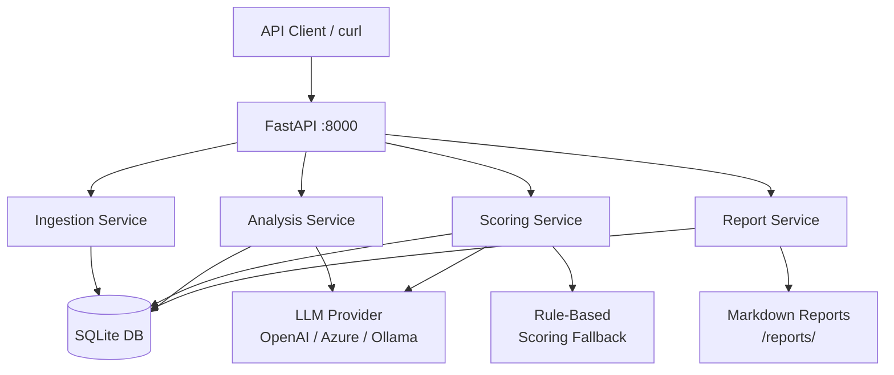

# CareerAgent

**Your AI-powered career intelligence assistant for software engineering leaders.**

CareerAgent analyzes job postings against your experience profile and scores how well each opportunity matches your background — so you spend your application effort on the roles most worth pursuing.

---

## Features

- **Job Posting Ingestion** — paste text, upload `.txt` / `.md` files, or POST via API
- **Candidate Profile** — structured JSON capturing work history, leadership, certifications, AI experience, and career goals
- **AI-Driven Job Analysis** — LLM extracts structured requirements from any job posting
- **Scoring Engine** — 0–100 scores across 6 dimensions with explanations
- **Gap Analysis** — missing skills, keywords, certifications, and leadership signals
- **Application Recommendation** — Strong Apply / Apply / Stretch / Low Priority
- **Markdown Reports** — shareable, downloadable analysis reports
- **Rule-Based Fallback** — works without an LLM API key using heuristic scoring

---

## Architecture



### Tech Stack

| Layer | Technology |
|---|---|
| API | FastAPI + Python 3.12 |
| Database | SQLite via SQLAlchemy 2.0 async |
| Schemas | Pydantic v2 |
| LLM | OpenAI-compatible (OpenAI, Azure, Ollama, LM Studio) |
| Container | Docker + Docker Compose |

---

## Quickstart

### 1. Clone and configure

```bash
git clone https://github.com/menzer81/CareerAgent.git
cd CareerAgent
cp .env.example .env
# Edit .env and add your OPENAI_API_KEY (optional — rule-based scoring works without it)
```

### 2. Run with Docker

```bash
docker-compose up
```

API is available at `http://localhost:8000`  
Interactive docs: `http://localhost:8000/docs`

### 3. Run locally

```bash
python -m venv .venv
.venv\Scripts\activate        # Windows
# source .venv/bin/activate   # macOS/Linux
pip install -r requirements.txt
uvicorn app.main:app --reload
```

---

## Workflow

### Step 1 — Load your candidate profile

```bash
curl -X PUT http://localhost:8000/api/v1/profile \
  -H "Content-Type: application/json" \
  -d @data/candidate_profile.json
```

Or upload via multipart:

```bash
curl -X POST http://localhost:8000/api/v1/profile/upload \
  -F "file=@data/candidate_profile.json"
```

### Step 2 — Ingest a job posting

```bash
# From a markdown file
curl -X POST http://localhost:8000/api/v1/jobs/upload \
  -F "file=@data/sample_job_posting.md" \
  -F "company=Meridian Financial Technologies"

# From raw text
curl -X POST http://localhost:8000/api/v1/jobs \
  -H "Content-Type: application/json" \
  -d '{"raw_text": "...", "title": "Director of Engineering", "company": "Acme Corp"}'
```

Note the `id` returned — e.g. `1`.

### Step 3 — Run analysis

```bash
# Full pipeline: extract requirements + score in one call
curl -X POST http://localhost:8000/api/v1/analysis/1
```

### Step 4 — Get the report

```bash
# View in terminal
curl http://localhost:8000/api/v1/reports/1

# Download as file
curl -o report.md http://localhost:8000/api/v1/reports/1/download
```

---

## API Reference

### Jobs

| Method | Endpoint | Description |
|---|---|---|
| `POST` | `/api/v1/jobs` | Ingest job posting (JSON body) |
| `POST` | `/api/v1/jobs/upload` | Ingest job posting (file upload) |
| `GET` | `/api/v1/jobs` | List all postings |
| `GET` | `/api/v1/jobs/{id}` | Get a posting |
| `DELETE` | `/api/v1/jobs/{id}` | Delete a posting |

### Profile

| Method | Endpoint | Description |
|---|---|---|
| `GET` | `/api/v1/profile` | Get candidate profile |
| `PUT` | `/api/v1/profile` | Create/update profile |
| `POST` | `/api/v1/profile/upload` | Upload profile from JSON file |

### Analysis

| Method | Endpoint | Description |
|---|---|---|
| `POST` | `/api/v1/analysis/{job_id}` | Run full analysis (extract + score) |
| `POST` | `/api/v1/analysis/{job_id}/extract` | Extract job requirements only |
| `POST` | `/api/v1/analysis/{job_id}/score` | Score only (requires prior extract) |
| `GET` | `/api/v1/analysis/{job_id}` | Get scoring result |
| `GET` | `/api/v1/analysis` | List all scoring results |

### Reports

| Method | Endpoint | Description |
|---|---|---|
| `GET` | `/api/v1/reports/{job_id}` | Get markdown report (inline) |
| `GET` | `/api/v1/reports/{job_id}/download` | Download report as `.md` file |

---

## Environment Variables

| Variable | Default | Description |
|---|---|---|
| `OPENAI_API_KEY` | *(empty)* | API key for LLM provider. Leave empty to use rule-based scoring. |
| `OPENAI_BASE_URL` | `https://api.openai.com/v1` | LLM base URL. Change for Azure, Ollama, etc. |
| `OPENAI_MODEL` | `gpt-4o` | Model name to use |
| `DATABASE_URL` | `sqlite+aiosqlite:///./career_agent.db` | SQLAlchemy database URL |
| `DEBUG` | `false` | Enable debug mode (verbose SQL logging) |
| `LOG_LEVEL` | `INFO` | Logging level |
| `REPORTS_DIR` | `./reports` | Directory for downloaded report files |

### Using a local model (Ollama)

```env
OPENAI_API_KEY=ollama
OPENAI_BASE_URL=http://localhost:11434/v1
OPENAI_MODEL=llama3.2
```

### Using Azure OpenAI

```env
OPENAI_API_KEY=your-azure-key
OPENAI_BASE_URL=https://YOUR_RESOURCE.openai.azure.com/openai/deployments/YOUR_DEPLOYMENT
OPENAI_MODEL=gpt-4o
```

---

## Scoring Dimensions

| Dimension | Weight | What It Measures |
|---|---|---|
| Leadership Match | 20% | MoM status, team size, seniority level |
| Technical Match | 25% | Required + preferred skill overlap |
| Cloud Match | 15% | Cloud platform and service alignment |
| AI Match | 10% | LLM/ML/AI experience alignment |
| Management Scope Match | 15% | Team size, org complexity, remote management |
| Industry Match | 15% | Domain/vertical experience |
| **Overall** | — | Weighted sum of above |

### Recommendation Tiers

| Score | Recommendation |
|---|---|
| 85–100 | 🟢 **Strong Apply** |
| 70–84 | 🔵 **Apply** |
| 55–69 | 🟡 **Stretch Opportunity** |
| 0–54 | 🔴 **Low Priority** |

---

## Candidate Profile Schema

The profile is a structured JSON document. See [`data/candidate_profile.json`](data/candidate_profile.json) for a full example.

Top-level fields:

```json
{
  "full_name": "...",
  "current_title": "...",
  "summary": "...",
  "years_total_experience": 15,
  "years_management_experience": 8,
  "work_history": [...],
  "leadership_experience": {...},
  "ai_experience": {...},
  "management_experience": {...},
  "technologies": [...],
  "cloud_platforms": [...],
  "certifications": [...],
  "education": [...],
  "accomplishments": [...],
  "industries": [...],
  "career_goals": [...]
}
```

---

## Data Files

The `data/` directory includes integration-ready files that can be loaded directly by scripts and external tools.

| File | Purpose |
|---|---|
| `data/candidate_profile.json` | Primary candidate profile used by the `/api/v1/profile` endpoints |
| `data/career_preferences.json` | Preference and targeting signals for role selection workflows |
| `data/stories.json` | Career achievement and story bank for narrative/report generation |
| `data/accomplishments.json` | Structured accomplishment bullets for tailoring applications |
| `data/sample_job_posting.md` | Sample job posting input for `/api/v1/jobs/upload` |
| `data/data_manifest.json` | Machine-readable index for scripts and external integrations |

If you automate ingestion, treat `data/candidate_profile.json` as the canonical profile source.

---

## Resume Generation Principles

CareerAgent must never invent:

- Employment history
- Job titles
- Team sizes
- Technologies
- Certifications
- Education
- Accomplishments
- Metrics
- Dates
- Business outcomes

All resume content must be traceable to one or more of:

- candidate_profile.json
- accomplishments.json
- stories.json

If supporting evidence cannot be found, the information must be omitted rather than generated.

---

## Running Tests

```bash
pip install -r requirements.txt
pytest
```

With coverage:

```bash
pytest --cov=app --cov-report=term-missing
```

---

## Project Structure

```
CareerAgent/
├── app/
│   ├── main.py              # FastAPI app entry point
│   ├── config.py            # pydantic-settings env config
│   ├── database.py          # SQLAlchemy async setup
│   ├── core/                # Exceptions, logging
│   ├── models/              # SQLAlchemy ORM models
│   ├── schemas/             # Pydantic v2 schemas
│   ├── repositories/        # Repository pattern data access
│   ├── services/            # Business logic
│   │   ├── llm/             # LLM abstraction layer
│   │   ├── ingestion_service.py
│   │   ├── analysis_service.py
│   │   ├── scoring_service.py
│   │   ├── gap_analysis_service.py
│   │   └── report_service.py
│   └── api/v1/              # FastAPI routers
├── tests/
│   ├── unit/                # Unit tests (scoring, gap analysis, ingestion)
│   └── integration/         # API integration tests
├── data/
│   ├── candidate_profile.json
│   ├── career_preferences.json
│   ├── stories.json
│   ├── accomplishments.json
│   └── sample_job_posting.md
├── Dockerfile
├── docker-compose.yml
└── .env.example
```

---

## Extending CareerAgent

The codebase is designed for extension without modification:

| Future Feature | Extension Point |
|---|---|
| Resume generation | Add `ResumeService` + `POST /api/v1/resume/{job_id}` |
| Cover letter generation | Add `CoverLetterService` + `POST /api/v1/cover-letter/{job_id}` |
| Application tracking | Add `applications` table + status state machine |
| Interview preparation | Add `InterviewPrepService` with LLM-generated Q&A |
| Multi-model support | Implement `BaseLLMProvider` with a different SDK |
| LinkedIn optimization | Add `LinkedInService` + profile diff endpoint |

---

## License

MIT
